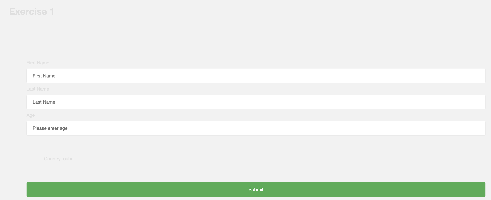
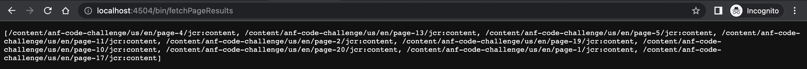

## Exercise 1: Saving data into JCR

Testing Instructions:

1. Navigate to /content/anf-code-challenge/us/en/userdata.html.
2. Create a system user as anfServiceUser.
3. For Age: enter minAge 18, maxAge 50.
4. Fill the user information and submit, check the information is stored under JCR (/var/anf-code-challenge)

- Note: We can fetch the path from the custom OSGI config, but we have declared a path as global variable(ContentServiceImpl).
  

## Exercise 2: News Feed Component

Testing Instructions:

1. Navigate to /content/anf-code-challenge/us/en/neewsfeed.html.
2. In JCR search for /var/commerce/products/anf-code-challenge/newsData reading attributes and displaying on the pages.
3. Test case is available under in progress

## Exercise 3: Query JCR

Testing Instructions:

1. Execute the Query result at /bin/fetchPageResults able to see SQL2 queries and displaying list of pages(attached screenshot for references).
2. Written Queries for SQL2 and Query Builder API.

## Exercise 4: Saving a property on page creation

Testing Instructions:

1. Create a page under /content/anf-code-challenge/us/en, navigate to JCR and check pageCreated property created.

listener available as PageCreateListener
